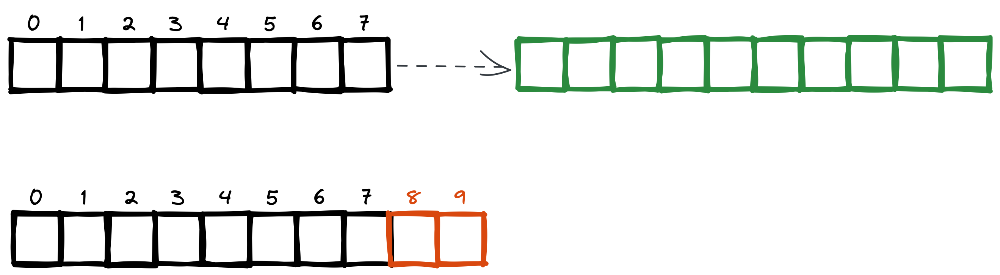

# Чтение логов.

Вычитка логов необходима в двух случаях:

1. Запуск узла, когда читаются записи после позиции указанной в слепке.
2. Когда ведомые отставшие узлы запрашивают изменения относительно их состояния.

Таким образом, должна предоставляться следующая функциональность:

1. Чтение лога начиная с указанной позиции – той, что сохранена в "размере лога" в состоянии сброшенном в слепок.
2. Поиск в логе элемента соответствующего состоянию после данного: когда ведомый узел запрашивает события после данного.

## Чтение с указанной позиции.

Просто сдвигаем позицию вычитки в файле на данную и осуществляем чтение.

## Чтение событий после данного.

В данном случае есть тонкости. А именно: последние события запечатлённые в логе ведомого узла могут отсутствовать в
логе лидера. Это крайне нехорошее явление, но такое возможно и следует предоставить способ разрешения коллизии.

На картинки пример коллизии, где верхняя строка – лог текущего лидер, а снизу лог ведомого узла.

Ситуация, которая могла привести к данному конфликту:

1. Имеется кластер состоящий из узлов A, B и C.
2. Сразу после момента записи события 7 отваливается узел A (текущий лидер).
3. Кластер продолжает функционировать на двух узлах B и C и происходит запись событий 8 и 9.
4. Кластер разваливается окончательно: машина B сгорает в пожаре, C удаётся спасти, но там повреждения не позволяющие
   немедленно продолжить работу, при этом данные целы.
5. Для продолжения функционирования системы запускается новый пустой узел, который, совместно с A, осуществляет работу.
6. Совершается работа, приводящая к появлению новых событий в логе.
7. Наконец, C починен и возвращается к работе.

В данном случае "доступность" системы в приоритете, поэтому мы и пришли к ситуации потери данных.

Чтобы разрешить этот конфликт, делается следующее:

1. Ищется последняя запись X в логе лидера предшествующая последней записи в логе ведомого.
    * Если она является последней записью у лидера, то происходит передача лидерства на подключившийся узел.
2. Данная запись находится в логе ведомого, записи после неё отрезаются ("физическое" усечение файла, 
   уменьшение его размера)
3. После этого из последнего слепка восстанавливается состояние и происходит применение записей.
4. Если восстанавливаемый узел не стал лидером, то запрашиваются и применяются отсутствующие локально события после X.

### Процедура поиска событий после данного.

Данная функциональность нужна исключительно для сценария для подхвата изменений ведомыми узлами:
ведомый узел запрашивает изменения после данного. Сразу отметим, что нужного события на лидере может и не быть – такое
возможно в случае развала кластера и падения некоторых его узлов и соответствует потере данных.

На лидере имеется список файлов с логов и их метаинформация, содержащая данные об идентификаторах первого и последнего
события в логе.

В начале мы ищем лог могущий содержать данное событие:

* Если лог начинается с данного события, то ищем позиции следующего, это и будет результатом поиска.
* Если лог заканчивается данным событием, то результатом будет позиция первой записи в следующем логе. Кроме случая
  когда этот лог являетя последним – тогда ведомому хосту сообщается что он находится в актуальном состоянии.
* Если событие выходит за пределы имеющихся на лидере, то это явный повод разменяться статусами.

Если лог найден и не выполнено ни один из пунктов выше, то приступаем к поиску внутри лога.

Лог состоит из последовательностей кадров, кадры упорядочены по хранимым в них событиям – самая ранняя запись в любом
последующем кадре всегда относится к более позднему событию, чем самая новая запись в данном кадре. Точно так же
записи в самом кадре так же упорядочены "хронологически": более высокая позиция в кадре прямо связана с более поздним
временем события.

Кадры имеют фиксированный размер и потому для поиска кадра имеющего внутри данную запись можно применить бинарный поиск.
Отметим, что нужная запись не является первой в первом кадре и последней в последнем – этот вариант отметается пунктами
при поиске кадра. Так же возможна ситуация, когда ни один лог не содержит данное событие – тогда мы сообщаем пару
(последнее предыдущее событие, первое последующее событие) руководствуясь исключительно метаинформацией. Последующих
событий может и не быть при этом, в этом случае ведомому надо становиться лидером.

#### Бинарный поиск кадров.

У нас есть левый кадр L (вначале это первый кадр лога) и правый кадр R (логический, следующий для последнего).

1. Если остался только один кадр (`R - L == 1`), то фиксируем его и выходим.
2. Выбираем центральный кадр C и смотрим индекс первой записи в нём.
   * Если она "меньше" чем искомая, то `L = C` и повторяем с 1.
   * В случаем если она больше чем искомая, то `R = C` и повторяем с 1.
   * Если она является искомой, то результатом поиска будет позиция следующей за ней – такая гарантированно существует.

В конце мы получаем единственный кадр, который может содержать данную запись. Её мы ищем читая данные событий одно за
другим:

1. Пробегаем по событиям:
   * Если событие произошло ранее искомого, то повторяем с 1.
   * Если событие является искомым, то возвращаем позицию следующего, оно может быть и первым в следующем кадре, если
     искомое является последним текущего. Заметим, что в условиях поиска следующий кадр есть всегда, т.к. иначе бы 
     событие было бы последним в логе, а такое отсеялось бы ещё на этапе поиска лога.
   * Если событие новее искомого, но предыдущее событие было старее искомого, то возвращаем пару их идентификаторов –
     ведомому нужно будет откатить события произошедшие после "последнего предыдущего" и накатить всё что после "новее искомого".