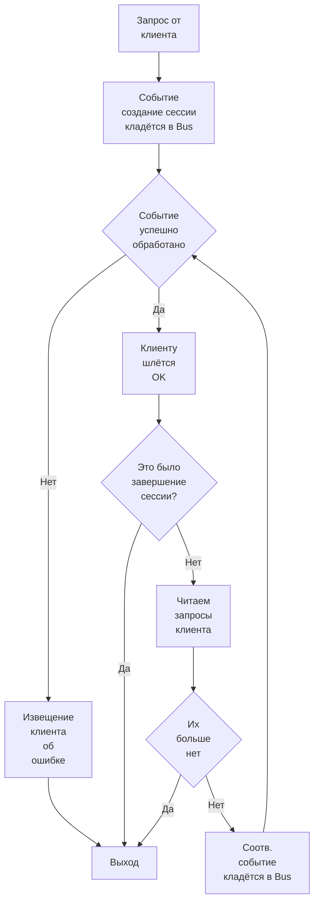

# Работа "кластера" с единственным узлом.

Для полного понимания необходимо ознакомиться с материалами по [взаимодействию сущностей](interactions.md) и 
[хранением данных](storage.md).

Итак, приступаем:

* При работе в режиме одного узла взаимодействия с другими узлами не происходит, т.е. никаких действительных попыток
  репликаций и прочего.

## Старт сервиса.

На старте сервис запускает следующие компоненты:

* Логический процесс по приёму сообщений от клиентов Server.
* Логический процесс по повторению незавершённых сессий Replay.
* Шину операций Bus.
* Ядро, машина состояний State.

Запуск выглядит следующим образом:

### 1. Инициализация Replay.

1. State инициализируется пустым значением.
2. Читается лог контроля состояний файлов и из данных в нём конструируются данные контроля состояний файлов — 
   это часть State.
3. Открываются первые файлы по каждому из временных интервалов — это тоже часть State.
4. Даётся извещение, что работы по восстановлению сохранённого состояния выполнены.
5. Начинается работа по непосредственному проигрыванию незавершённых сессий. Об этом позже.

### 2. Дальнейшие операции запуска.

После получения извещений о готовности Replay запускаются Server и Bus.

## Работа Replay.

В материале по одной из ссылок в самом верху было упомянуто, что данные для сессий с разными таймаутами для повтороения
хранятся в разных файлах, записи в этих файлах упорядочены по возрастанию времён повторения записанных там сессий, а
сами файлы для данного таймаута так же упорядочены по значению Replay в файле, причём гарантируется, что если A.Replay 
меньше чем B.Replay для разных файлов, то все времена повторов в A не больше любого из времён повторов в B. 
Т.е. определён безусловный порядок по проигрыванию незавершённых сессий.

Внимание: Replay файла и время повторения сессии — разные величины с единственной гарантией: A.Replay ⩽ T, где
T — время повтора любой произвольно взятой сессии из файла.

Таким образом, вычитывая сессии из всех этих файлов одновременно, мы можем выстроить их в порядке повтора.

### Алгоритм работы Replay.

1. Итерируемся по бесконечной последовательности восстанавливаемых сессий.
2. Когда пришло время повтора сессии кидаем соответствующее задание в шину.

## Работа Server.

Схема работы потоков сервера очень проста:

Т.е. вся работа с данными делается в недрах машины состояний узла, а сам поток просто реагирует на изменения состояния.

## Работа машины состояний State.

Вся работа машины состояний основывается на последовательном исполнении операций переданных через Bus.

При получении очередной операции оттуда она применяется к состоянию и, при необходимости в этом, об успехе операции
извещаются заинтересованные.

## Работа шины Bus.

Здесь ничего особенного. По всей видимости просто канал.
