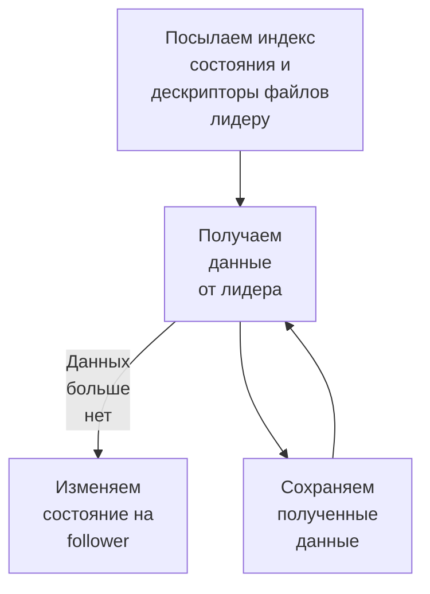

# Работа синхронизирующегося узла

```mermaid
flowchart TD
  A[Посылаем индекс\nсостояния и\nдескрипторы файлов\nлидеру]
  B[Получаем\nданные\nот лидера]
  D[Сохраняем\nполученные\nданные]
  E[Изменяем\nсостояние на\nfollower]
  
  A --> B
  B --> |Данных\nбольше\nнет|E
  B --> D
  D --> B
```

При этом до проведения операции нужно выяснить, какой из узлов является лидером, в среднем это будет занимать не более
одного запроса.
