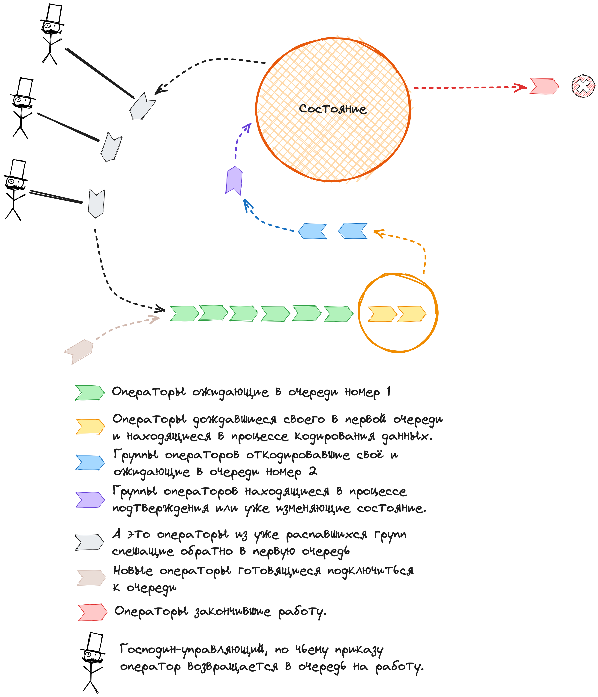

# Разбор процесса выполнения операций.

В данном документе формулируется методика выполнения операций над машиной состояний.

## Операции с машины состояний.

Они описываются следующим интерфейсом:

```go
type State interface{
    // New создание новой сессии с заданной темой и первым куском данных в ней.
    New(theme uint32, data []byte) (Session, error)
	
    // Repeat вычитывает до n сессий с повтором в заданное время.
    Repeat(t uint64, n int) ([]Session, error)
    
    // Append добавление нового куска данных в заданную сессию.
    Append(session Session, data []byte) error
    
    // Replace замена имеющихся кусков данных в сессии на данный. 
    Replace(session Session, data []byte) error
    
    // Remove удаление данной сессии.
    Remove(session Session) error
    
    // Store сохранение данной сессии с указанным в секундах временем повтора.
    Store(session Session, repeatTimeOut uint64) error
}
```

## Как всё используется на высоком, клиентском уровне.

На этом уровне операторы проходят следующий цикл:

1. Создают новую сессию или получают готовый объект с ней.
2. Проводят операции Append/Replace, руководствуясь указаниями потребителей.
3. В конце либо удаляют её, либо задают повтор.

А есть ещё задача не допустить появления свободно болтающихся сессий, у которых оператор
с управляющим давно не у дел. Она решается в рамках процесса.

А далее переходим к сути.

## Как происходит выполнение операции:

1. Клиент дёргает один из методов, т.е. запрашивает выполнение операции над состоянием. 
2. Оператор кодирует описание операции.
3. Операция подтверждается с использованием кодированных данных операции. Это включает в себя:
   1. Отправка кодированной операции последователям. Только в кластерном режиме.
   2. Ожидание подтверждения от последователей. Только в кластерном режиме.
   2. Сохранение кодированной операции в лог операций.
3. Оператор применяет операцию к состоянию.
4. Потребителю отдаются нужные данные.
5. Потом потребитель может что-то ещё ответить и по результатам ответа решается, что делать дальше.


Заметим, что из всех этих этапов только второй может вызвать ошибочное состояние:
 - Не получилось сохранить кодированные данные.
 - В случае кластерного режима:
   - Не удалось отправить кодированную операцию.
   - Последователи не подтвердили операцию.
   - Последователи не смогли отправить подтверждение.
Но это неважно, наверное. Потому что в операторе мы никогда не выходим с ошибками, кроме случая когда ошибок много.
Но этот случай ведёт к аварийному корректному останову системы.

# LLD.

Так как операции над состоянием не могут осуществляться одновременно, необходимо ожидание своей очереди.
Т.е. оператор должен:

1. Дождаться очереди.
2. Закодировать данные своей операции.
3. Отправить запрос на подтверждение и дождаться его.
4. Выполнить изменение состояния.
5. Посоветоваться с управляющим, что делать раньше.
   6. Если насоветована новая операция, то повторяем сначала. 
   7. А если было удаление сессии любого типа, то просто заканчиваем игру.

В процессе могли происходить ошибки, в таком случае оператору ставится задача выполнить сохранение сессии, он
будет это делать хоть до второго пришествия. Это и решает поставленную выше задачу по недопущению отвалившихся
сессий: оператор ведущий сессию не уходит до тех пор, пока сессия жива.

Наиболее узким местом в этом списке является синхронное по устройству взаимодействие через сеть с последователями: 
абсолютно критично уметь делать меньшее число системных вызовов при отправке. 

Это означает, что принимающая следующего из очереди сторона должна получать сразу несколько подписчиков за один раз.
Т.е. принимается несколько операторов из очереди. В таком случае имеет смысл иметь двойную очередь:

1. Первая очередь принимает какое-то количество операторов.
2. Эти операторы сразу кодируют свои данные.
3. Для кластерного режима здесь можно сразу составить запрос к последователям.
4. Дожидаемся во второй очереди для подтверждения операций.
5. Проводим работу по подтверждению.
   1. Для кластерного режима проводим взаимодействие с последователями.
   2. Пишем данные в лог операций.
6. Применяя операторы последовательно изменяем состояние.
7. Отдаём свою очередь следующей партии операторов ожидающих подтверждения для своих операций.
8. После этого оператор должен посовещаться с управляющим и т.д. как уже было описано.



## Как это представить в коде на Go.

С очередями всё понятно:

### Первая очередь.

Первая очередь представляет собой канал, в который кидают объект предоставляемый оператором называемый 
**задачей оператора**. У этого канала есть **обработчик**, который вычитывает пачку операторных объектов и запускает 
кодирование на каждом из операторов получая от них последовательность кодированных операций.
Т.е. у объекта должен быть метод `Encode` производящий кодирование. Его сигнатуру мы разберём позднее. 
Сформированная пачка с данными и задачами операторов затем участвует в регистрации операции. Канал
этой очереди называется каналом **операций**.

### Вторая очередь.

Вторая очередь представляет собой два канала:

* В первый канал заходят задачи с группой операторов и данными. Назовём его каналом **задач**, или просто задачами.
* Во второй канал пишется когда закончена работа с очередной группой, сигнализирую о готовности к работе. Назовём
  это каналом **слотов** (задач), или просто слотами.

Соответственно, у этой очереди тоже есть обработчик. Он работает следующим образом:

### Циклы работы обработчиков.

#### Цикл работы второго обработчика.

Он начинает свою работу с

1. Заполнения слотов (**буферизованного канала размером N**) данными о готовности к работе. 
2. Начинает чтение задач.

И далее
1. Вычитывает пачку операторов и сгенерированных ими данных из канала задач.
2. Для кластерного режима пытается добиться консенсуса. Это может привести к ошибке, в таком случае
   нам нужно сообщить операторам задач об ней и завершить работу. Пусть это будет `ReportError(errcode int)`.
   Где `errcode` намекает о сути проблемы – подробности управляющим неинтересны.
3. Пишет кодированные операции на диск.
4. Последовательно применяет к состоянию задачи операторов. Вместо традиционного для стратегий `Execute`
   назовём его `Apply(s *State)` – т.к. оно соответствует термину "применять".
5. Пишет в канал слотов, освобождая место для любителей повисеть на рабочем канале.

### Цикл работы первого обработчика.

1. Он читает канал слотов.
2. Вычитывает M задач операторов из канала первой очереди. Количество M разумно оценивать из нагруженности 
   второго обработчика. Если у в канале задач никого нет, то нужно ограничиться вычиткой одной задачи – чтобы 
   уменьшить задержки системы при низкой загрузке. Если загрузка высокая, то в очередь в рабочий канал не будет пустой 
   и тогда можно задачи набирать от души. Но не слишком много, разумеется.
3. Запускает горутину которая:
   1. Закодирует данные с помощью задач оператора.
   2. Встанет в очередь на запись в канал задач.

Оценивать нагруженность можно с помощью счётчика который:

* Увеличивается горутиной запущенной первым обработчиком.
* Уменьшается после записи в канал подготовки, после завершения цикла работы второго обработчика.

### Сигнатура метода Encode у задач операторов и содержимое канала подготовки.

Методу Encode нужны буфера для размещения кодированных данных. Канал слотов бог знает что возит. Может и ничего
не возить, т.е. `struct{}`. Но лучше возить в т.ч. и [это](https://pkg.go.dev/github.com/sirkon/mpy6a@v0.0.0-20230522171544-094984410973/internal/bytespool).

Потому что кодированные данные нам нужны только до момента записи их на диск. Т.е. нарисовывается квант времени начиная
с момента получения этого пула из очереди подготовки (вот это название и получает разумное объяснение) до момента
сохранения кодированных операций в лог. 

На самом деле лучше возить вот это:

```go
type Job struct{
    Pool    *bytespool.Pool
    Tasks   []*OperatorTask
    Buffers [][]byte
}
```

Чтобы переиспользовать и готовые слайсы тоже. 

И здесь уже формулируем как выглядит задача оператора: 

```go
type OperatorTask interface{
    Encode(*bytespool.Pool) []byte
    ReportError(errorcode int)
    Apply(*State)
}
```

## Примерный вид соответствущего Go-кода

Он практически так и будет выглядеть, почти один в один.

```go
const (
    defaultCap = 5*1024*1024 // 5Mb
    N = 5
    maxOpsPerCommit = 10
)

var (
    cancel func(err error)
    done chan struct{}
    chanOps chan OperatorTask
    chanJobs chan *Job
    chanSlots = make(chan *Job, N)
    chanSlotReady = make(chan struct{}, 2*N)
    jobQueueDepth int32
)
…

// Второй обработчик
go func() {
    go func() {
        for i := 0; i < N; i++ {
            chanchanSlots <- &Job{
                Pool: bytespool.New(defaultCap),
                Tasks: make([]&OperatorTask, 0, maxOpsPerCommit)
                Buffers: make([][]byte, 0, maxOpsPerCommit),
            }
        }
    }()

    var job *Job
    for {
        // Получаем задачи из рабочего канал.
        select {
        case job = <-chanJobs:
        case <-done:
            return
        }

        // Уменьшаем длину очереди.
        atomic.AddInt32(&jobQueueDepth, -1)


        // Делаем нужные действия с буферами и задачами.
        if err := doJob(job); err != nil {
            // Ошибка может быть только критической, вроде ошибок записи.
            cancel(err)
            return
        }
        
        // Пакет задач выполнен, данные больше не нужны.
        // Поэтому просто чистим носитель и отправляем его обратно.
        // Так же даём сигнал, что слот готов.
        chanSlots <- job.Reset()   
        chanSlotReady <- struct{}{}
    }
}()

// Первый обработчик
go func() {
    for {
        // Запрашиваем слот для задач.
        var job *Job
        select {
        case job = <- chanJobs:
        case <-done:
            return
        }
        
        // Вначале очищаем канал об освободившихся слотах.
        // Это нормально, поскольку никто кроме нас его не читает и в данный момент 
        // нас не интересует, появился ли слот или не появился.
        LOOP:
        for {
            select {
            case <-chanSlotReady:
            default:
                break LOOP
            }
        }
        
        // Читаем канал операций получая оттуда задачи операторов.
        // При пустой очереди мы должны отдавать накопленное сразу, иначе будут расти задержки.
        // Но мы выходим и в случае если в очереди только один элемент,  потому что нам понадобится ещё какое-то время, 
        // чтобы выполнить кодирования – всё для уменьшения задержек.
        for (atomic.LoadInt32(&jobQueueDepth) < 2 && len(job.Operators) > 0) || job.Count() < maxOpsPerCommit {
            // Запрашиваем задачу.
            select {
            case task := <- chanOps:
                job.AddTask(task)
            case <-done:
                return
            case <- chanSlotReady:
                // Освободился слот под задачи.
            }
        }
       
        go func() {
            for _, task := range job.Tasks {
                job.Buffers = append(job.Buffers, task.Encode(job.Pool))   
            }
            
            // Увеличиваем длину очереди и засовываем в канал задач.
            atomic.AddInt32(&jobQueueDepth, 1)
            chanJobss <- job
        }() 
    }       
}()
```

