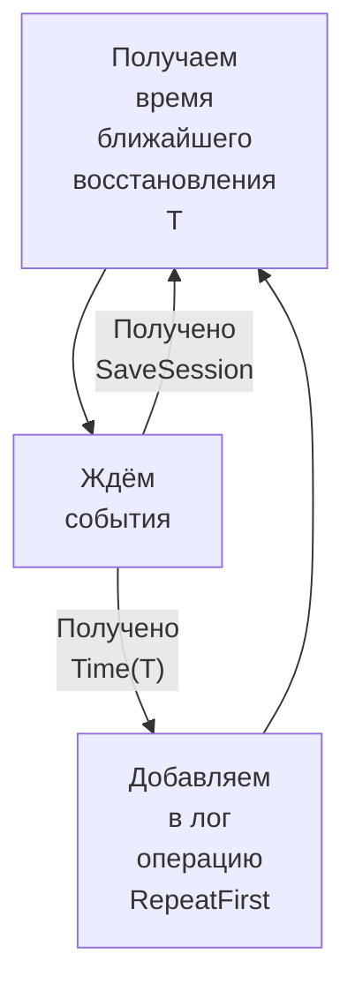

# Повтор сессий.

Чтобы понимать о чём идёт речь, нужно ознакомиться с описанием [хранилища](storage.md).

## Введение.

Восстанавливаются, естественно, только сохранённые сессии, которые у нас могут храниться в одном
из следующих трёх источников:

1. В оперативной памяти, где сессии они находятся в упорядоченном по времени восстановления доступе.
2. В частях слепков хранящих упорядоченные по времени восстановления сохранённые сессии.
3. В слитых файлах хранящих упорядоченные по времени восстановления сохранённые сессии.

## Алгоритм инициализации повтора сессии.

Все эти источники объединяются в один логический источник (на основе подхода близкого по смыслу к алгоритму
сортировки слиянием) и предоставляют следующую функциональность.

* Получить время ближайшего восстановления — возвращаем время первой сессии.
* Вытащить данные первой сессии.
* Подтвердить вычитку данных первой сессии — она всегда должна выполняться без ошибок и после её исполнения данная
  сохранённая сессия полностью удаляется из источника.

1. Получаем время ближайшего восстановления T.
2. Ожидаем следующие два события и в соответствии с ситуацией выполняем:
   * Дождались наступления времени T — событие Time(T)
     Тогда
     1. Добавляем в лог операцию "приступить к восстановлению первой сессии": RepeatFirst
     2. Повторяем с 1-го шага
   * Была сохранена сессия — событие SaveSession
     Тогда
     1. Повторяем с 1-го шага

Или, в виде блок-схемы:



Замечание: при добавлении новой операции в лог у нас событий может быть уже великое множество и встаёт вопрос — 
добавлять его первым, или после всех имеющихся?

1. Добавление первым имеет следующее преимущество: мы сразу можем сказать из какого источника читать, т.к. ориентируемся
   по текущему состоянию, но это будет минусом для клиентов ожидающих прохода "своих" операций — появляется задержка.
2. Во втором варианте ведомые узлы будут вынуждены искать у себя первую запись сами, т.е. на них немного подрастёт 
   нагрузка на ЦПУ из-за необходимости выбирать нужную запись.

Склоняюсь ко второму варианту.

## Алгоритм проведения повтора сессии.

Итак, машина состояния получила операцию "повторить первую сессию".

Первым шагами будут:

1. Дожидаемся рассылки этой операции на кворумное число узлов.
2. Вычитываем первую сессию и кладём в активные.
3. Подтверждаем выполнение операции (commit).
4. Подтверждаем получение первой сессии.

После выполнения этих шагов сессия оказывается в оперативной памяти, после чего:

1. В фоне запускаем процедуру повтора сессии — она проводится посредством некоторого интерфейса, реализация которого
   возлагается на клиента. В процессе через лог могут проводиться операции мутации сессии, отправки на дополнительный
   повтор и т.п.
2. Процедура завершается с ошибкой или с успехом. 
   * В случае успеха сессия удаляется.
   * В случае ошибки сессия отправляется на дополнительный повтор.

Интерфейс, который будет необходимо реализовать клиенту, может выглядеть примерно как:

```go
type RepeatHandlerGetter interface{
	RepeatHandler(theme int32, data []byte) (RepeatHandler, error)
}

type RepeatHandler interface{
	NextOperation() (OperationDeliverer, error)
	Cancel() error
}

type OperationDeliverer interface{
	Operation() Operation
	Acknowledge() error
	Refuse(refuse RefuseReason)
	Cancel() error
}
```

где `Operation` каким-либо образом представляет различные типы операций:

* Удалить сессию
* Добавить запись в сессию
* Перезаписать сессию
* Завершить выполнение сессии (приводит к ошибке процедуры повтора)

После разбора операции необходимо выполнить выбрать что-нибудь из:

* `Acknowledge` подтверждение приёма операции.
* `Refuse` отказ от приёма операции, клиенту сообщается о некорректных данных операции. Например, результат исполнения
  полученной операции может вылиться в превышение максимального размера сессии. Данная операция не завершает
  взаимодействие, приём операций продолжается.
* `Cancel` отменяет дальнейшее взаимодействие. Применяться может, разве что, как часть процедуры "graceful stop".

Аналогично, вместо приёма очередной операции (`NextOperation`) может быть вызван метод `Cancel`, но это, опять же,
разве что в рамках мягкого останова сервиса.
