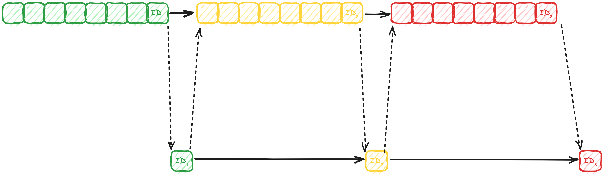

# Хранение и использование данных сохранённых сессий.

## Какие свойства должно обеспечивать хранилище.

1. Сохранение сессии должно иметь предсказуемую сложность исполнения.
2. Нахождение сессии для повтора должно быть достаточно быстрым.
3. Порядок повтора сессий должен удовлетворять следующим свойствам:
   - По времени повтора. У кого оно меньше, те отправляются на повтор раньше.
   - В случае одинакового времени повтора первой отправляется та сессия, которая была сохранена раньше.

Пункт номер 2 является менее приоритетным, поскольку гарантии исполнения близкие к абсолютным
в рамках сетевой инфраструктуры невозможны в принципе.

## Предлагаемый вариант хранилища.

Предлагается использовать подход [LSM](https://ru.wikipedia.org/wiki/LSM-дерево) без индекса ключей – он не нужен,
т.к. нет потребности доставать произвольную сессию: они нам нужны только тогда, когда приходит время их повтора.

Т.е. для хранения сохранённых сессий используются:

- Упорядоченные структуры в памяти, под это хорошо подходят различные варианты сбалансированных деревьев.
- Файлы со следующей структурой:

  | `repeat1` | `len1` | `data1` | `repeat2` | `len2` | `data2` | ... |
  |-----------|--------|---------|:----------|:-------|:--------|:----|

  Где

  | Поле      | Роль поля                          |
  |-----------|------------------------------------|
  | `repeatN` | Время повтора в секундах задачи N. |
  | `lenN`    | Длина бинарных данных задачи N.    |
  | `dataN`   | Бинарные данные задачи N.          |

  И здесь `repeat1 ≤ repeat2 ≤ repeat3 ≤ …`, т.е. записи в файле упорядочены по времени повтора.

Как принято для LSM, данные вначале скидываются в упорядоченные структуры данных, а затем, когда их объём превосходит
пороговый, сбрасываются в файл с вышеописанной структурой.

Как и в стандартном LSM-подходе, разные файлы могут объединяться время от времени, чтобы уменьшалось общее количество
используемых файлов.

### Оценка соответствия этого хранилища требуемым свойствам.

- Сложность сохранения сессии равна сложности вставки в сбалансированное дерево. Т.е. она не превосходит O(N×log N),
  где N – ограничение на количество хранимых в памяти сохранённых сессий. Это число фиксировано, поэтому сложность
  сохранения является константной величиной.
- Сложность поиска складывается из сложности вычитки данных из файлов, вычитки данных из памяти и поиска "наименьшего"
  элемента среди вычитанных. Рассмотрим покомпонентно:
    - Стоимость вычитки из неопределённого количества файлов оценим отдельно.
    - Стоимость вычитки из памяти оценивается как то же самое O(N×log N), т.к. кроме чтения нужно и удаление, которое
      ровно столько и весит (больше, чем поиск старшей записи). Т.е. это фиксированная сложность.
    - Стоимость поиска ближайшего повтора среди всех источников рассмотрим отдельно.
- Порядок рассмотрим отдельным пунктом.

#### Сохранение порядка повтора.

##### Случай первый. Сбросов контейнера в файлы не было.

В этом случае нам достаточно затребовать, чтобы контейнер C семантически бы совпадал с упорядоченным деревом,
узлы которого индексированы по времени повтора, а значениями являются списки сессий. При сохранении сессии
мы 

1. Берём узел соответствующий данному времени повтора. Или создаём его, если такого узла нет.
2. Добавляем в список сессий этого узла новую сессию, в конец – список же.

При проигрывании сессий мы берём первый узел и последовательно запускаем повтор для сессий хранимых в нём. Т.е.
для такого контейнера свойство упорядоченности повтора является натуральным следствием самой структуры данных.

##### Случай второй. Были сбросы контейнера, но не было объединений источников.

Пусть у нас есть набор файлов F<sub>1</sub>, …, F<sub>n</sub> и контейнер C.
Здесь каждый из файлов является "сбросом" содержимого контейнера и известно, что F<sub>1</sub> был сброшен раньше
чем F<sub>2</sub>, F<sub>2</sub> раньше чем F<sub>3</sub> и так далее.

Повторяя сессии на момент T мы смотрим, есть ли они в F<sub>1</sub>, затем в F<sub>2</sub>, …, F<sub>n</sub> и, 
в последнюю очередь, в контейнере C. Т.к. файл F<sub>1</sub> был создан раньше чем F<sub>2</sub>, то и сессии
с одинаковым временем повтора там были записаны раньше. То же самое и в отношении контейнера C: его содержимое
всегда "новее" чем у источников.

Т.е. здесь свойство порядка, при данном способе вычитки, так же выполняется.

##### Случай общий. Есть источники полученные объединением источников.

Сразу рассмотрим объединение источников F<sub>i</sub> и F<sub>i+1</sub> – в терминах файлов из предыдущего раздела.
Все сессии с фиксированным временем повтора T сохранённые в нём будут "младше" сессий в файлах F<sub>j</sub> при
j < i и "старше" при j > i. Если мы заместим F<sub>i</sub> и  F<sub>i+1</sub> их слиянием M, то свойство
порядка сохранится.

Но если мы сольём не соседние файлы, то порядок может нарушаться. Например: M = F<sub>1</sub> ∪ F<sub>3</sub>. Здесь:

- Если мы замещаем F<sub>1</sub> на M, то сессии ранее принадлежащие файлу F<sub>3</sub> могут начать проигрываться
  ранее чем сессии из F<sub>2</sub>, которые старее.
- Если мы замещаем F<sub>3</sub> на M, то более новые сессии из F<sub>2</sub> могут начать проигрываться ранее чем
  сессии ранее бывшие в F<sub>1</sub>.

Т.е. сливать можно только "соседние" источники. Предлагается сливать последние два (три, …) источника, потому что
тогда, натуральным образом, слитый источник замещает два последних элемента и это выражается в индексе его создания –
он будет старше остальных.

#### Стоимость вычитки с неопределённым количеством файлов.

Здесь и далее **фрагментацией** будем называть количество файлов. **Фрагментацией(ΔT)** будем называть количество
файлов, повторы всех сессий которых происходят до момента "текущее время" + ΔT.

Если бы файлы не сливались, то стоимость вычитки из них равнялась бы стоимости вычитки из одного файла – потому что
одна сессия читается ровно один раз. Когда в дело вмешивается сливатель сшивающий файлы, то количество прочтений
увеличивается на одно за каждую процедуру слияния – но в этом случае нагрузка размазывается по времени, поскольку
сливать файлы, сессии из которых готовятся к повтору в ближайшее время, несколько неразумно.

В итоге получаем, что на практике стоимость вычитки с неопределённым числом файлов примерно равна стоимости вычитки
одного файла. Но с одним жирным **НО**: если распределение времён повторов каждого конкретного файла не равномерное
и имеет такие пики, которые не совпадают с пиками других файлов. В этом случае мы получаем набор сильно 
последовательных чтений, что действительно будет делать многофайловое чтение близким по эффективности к однофайловому.
В ином случае степень последовательности будет определяться размером буфера чтения каждого файла.

#### Стоимость поиска ближайшего повтора.

Есть O(M), где M - число источников. При этом не забываем, что один источник может иметь несколько сессий с одинаковым
временем повтора и они в приоритете по сравнению с сессиями из следующих источников.

### Представление в памяти.

Просто сбалансированное дерево, красно-чёрное например.


### Итераторы по источникам сохранённых сессий.

Интерфейс итератора по источнику повторов выглядит как

```go
type StoredSessionsIterator interface{
    // Next проверка, есть ли следующая запись повтора.
    Next() bool
    
    // RepeatData данные повтора сессии. Возвращает repeatAt
    // время повтора сессии в секундах и данные сессии.
    RepeatData() (repeatAt uint64, session *types.Session)
    
    // Commit подтверждение вычитки. Без вызова этого метода
    // следующий Next возвратит неуспех.
    Commit()
    
    // Err сообщает, является ли окончание итерации следствием ошибки.
    Err() error
    
    // Close закрытие итератора – необходимо для итераторов по файлам.
    // Итератор по дереву, понятно, будет поддерживать этот метод
    // чисто символически.
    Close() error
}
```

Список таких итераторов не является статическим и может меняться:

- Итератор, который пробежал весь файл с повторами удаляется из списка.
- При сбросе содержимого памяти на диск итератор по соотв. файлу добавляется в конец списка.


> Таким образом, набор итераторов проще всего хранить в контейнере типа двусвязный список.<br>
> Любая мутация этого списка, естественно, производится только в момент когда не идёт процесс поиска повторов.

### Когда и как создаются файлы с источниками сессий.

Вначале сессия сохраняется прямо в память. При сохранении очередной сессии, если превышен пороговый объём
хранимых в памяти данных повторов и не идёт других фоновых процессов для повторов, инициируется процесс
сброса данных из памяти в соответствующий файл. **Индексом файла** будет являться индекс операции сохранения сессии.

Процесс создания источника соответствующего дереву в памяти на момент начала длиться какое-то время и дерево
в памяти может претерпевать при этом изменения: удаление сессий для их повтора и добавление новых сессий.

Простейшим вариантом разрешения таких коллизий является простой сброс сборки источника. Но это оооочень такое
себе решение. Если с удалением ещё более-менее терпимо, т.к. объём занимаемой памяти уменьшился и может даже
стал ниже порогового, то с добавлением вообще никуда. Поэтому так делать мы, естественно, не будем и предложим
другой вариант.

Итак, какие логические коллизии могут произойти, если без сброса:

- Во время сохранения какая-то сессия была добавлена в конец контейнера, и мы сохраним и её. Это не говоря
  уже о том, что само итерирование над мутирующим контейнером затея весьма сомнительная.
- Во время сохранения какая-то сессия ушла на повтор уже после момента её сохранения в новый файловый источник.
  А когда источник начнёт проигрываться она вновь будет предоставлена итератором, т.е. произойдёт второй её
  повтор.

Первая коллизия решается сохранением не самого контейнера, а его полного клона, включая и копию списка содержащего
куски данных сессии. Сами куски данных записанных в сессию можно не клонировать – их содержимое никогда не изменяется.

Вторая коллизия решается исходя из факта, что и повтор, и сброс сессий осуществляется в одном и том же порядке.
Это означает, что нам достаточно сохранять длину отправленных на повтор сессий и учесть их после создания, указав
начальную позицию в файле которая бы пропускала записи соответствующие ушедшим на повтор сессиям. Но даже так
есть один тонкий момент:

- Сессия А была сохранена после начала создания источника.
- Сессия А была отправлена на повтор до момента окончания создания источника.

Этой сессии в файле естественно не будет: её нет в оригинальном контейнере. Т.е. нам необходимо пропускать такие 
сессии для вычисления начальной позиции чтения создаваемого источника.

Следующий подход обойдёт вышеописанные коллизии:

1. Создаётся клон контейнера (A), содержимое которого будет сбрасываться на диск.
2. В состоянии, впридачу к контейнеру, создаётся пустой контейнер B.
3. При сохранении сессий они появляются и в старом, и в новом контейнере.
4. При повторе сессии проверяется, нет ли её в новом контейнере:
   - Если её нет, то увеличиваем значение смещения.
   - Если есть, то удаляем и из старого, и из нового контейнеров.
5. После окончания создания заменяем контейнер A на B, вторичный контейнер делаем неактивным и добавляем
   в конец списка итераторов новый – это будет итератор над только что созданным файлом, у которого начальная
   позиция чтения равна посчитанному значению. Вполне может быть и так, что к моменту создания эта позиция
   будет совпадать с длиной созданного файла. В таком случае итератор не добавляется, а контейнер B просто удаляется.

### Когда объединяются файлы с повторами.

В фоне постоянно висит процесс периодически проверяющий количество разных источников. Если их больше чем нужно,
то в очередь добавляется операция процесса объединения, который создаёт копии итераторов (файл, смещение) и проводит 
в фоне операцию слияния. При этом, если в оригинальных итераторах происходит вычитка сессии для повтора, то длина 
вычитанных данных доводится до процесса производящего слияние.

Аналогично процессу создания источника, это значение будет учтено при расчёте позиции начального чтения в файле
объединения.

Когда слияние проведено физически, итератор над слитым файлом должен быть добавлен в состояние, а старые итераторы
удалены.

### Индексы файлов-источников.

Процесс создания (и слияния) дерева осуществляется через очередь операций.

### Коллизии процессов использующих итераторы и объекты скрытые за ними.

Их нет, т.к. все операции могущие вызвать коллизию:

- Итерирование по источникам и их чтение.
- Запись в контейнер.
- Копирование контейнера.

Изолированы рамками операций – все они осуществляются в рамках своих операций. Остальные действия производятся
исключительно со "своими", локальными данными.

## Хранение метаданных источников.

При создании источников, т.е. при сбросах контейнера или слияниях разных источников, мы могли бы применить
"бестелесные" операции, как и в случае создания слепков. Т.е. операция есть, но она не сохраняется ни в логе,
ни в `AppendEntries` при взаимодействии с последователем.

Но для источников такой подход не является, мягко говоря, оптимальным. Потому что созданные после создания слепка 
источники "теряются" при остановке системы, т.к. информации об них нигде нет. 
При этом логика функционирования состояния требует сброса или слияния в любом случае, в т.ч. и при применении операций. 
А это означает что источники будут созданы вновь. Старые файлы при этом ни куда не денутся и могут продолжать 
болтаться, занимая дисковое пространство. При даже наличие незарегистрированного файла-источника с нужным индексом
ничего не может гарантировать. Например:

1. До остановки при индексе состояния ID произошёл сброс контейнера в соотв. файл.
2. После перезапуска, из-за неупорядоченности процесса, при индексе состояния ID началось объединение источников
  созданных при ID<sub>1</sub> и ID<sub>2</sub>.

Т.е. индекс источника тот же самый, а вот содержимое может кардинально различаться. Пример демонстрирует, почему после
перезапуска мы должны полностью игнорировать источники созданные после создания слепка.

И так, нам нужно каким-то образом сохранять информацию о создаваемых источниках. Чисто логически, у нас есть следующие
варианты:

### Операция создания источника вообще никак не отображается в логе операций.

Но какой-то лог нам всё-таки нужен. Т.е. здесь появляется второй лог, исключительно для данного типа операций.
Предположительно чисто локальный, хотя в теории можно заморочиться и модернизировать RAFT до поддержки `AppendEntries`
второго лога. Но это не очень идея как по мне.

Т.е. локальный дополнительный лог для операций создания источников.

Он должен выглядеть примерно так:



Т.е. записи в логе источников привязываются чётко к предыдущей операции в логе операций и строго
предшествуют следующей операции в логе операций.

### Операция создания источника пишется в лог операций, но не влияет на индекс состояния.

В обычном логе состояний такое может идти только как атрибут другой операции, т.к. нам записи
в нём нужны только строго упорядоченными. И здесь возникают проблема в выборе операции, атрибутом
которой должна стать данная. 

- Предыдущая? Мы можем быть первой операцией пакета.
- Следующая? Мы можем быть операцией после которой долго не будет другой.
- Отдельно обрабатываем эти краевые случаи, а для остальных берём предыдущую или следующую?

НМВ все эти варианты выглядят так себе – непонятно ради чего усложняется логика.

### Операция создания источника пишется в лог операций как обычная операция.

Т.е. появляются операции соответствующие методам интерфейса

```go
type OperationLogRecorder interface{
    …
    SourceMemoryDump() error
    SourceMerge(id1, id2 types.Index) error
}
```

В этом случае у нас появляется синхронизация по создаваемым источникам. Потому что эта опция будет на всех узлах
и ведомые узлы не смогут писать свои собственные, по понятным причинам.

У меня есть планы для такого подхода: большие куски данных, а в файлах они такие, удобны для переброса данных.
А переброс данных нужен для задачи балансировки кластеров.

При таком подходе потребуется модернизация RAFT, т.к. для задачи переброски файлов нужно понимать, что
файл имеется. А запись вида "создать источник" говорит лишь только о начале создания, а не об его окончании.
Т.е. нужна завершающая запись "подтверждение создания источника", а такая может делаться только когда он
действительно создан на кворумном числе узлов.

Ничего не мешает добавить дополнительный атрибут "create done" в данные регулярного перестук между узлами, когда
ведомый проставляет этот флаг в ответ на регулярный `AppendEntries` лидера. Таким образом лидер будет знать, когда
достаточное число узлов выполнило создание и, в конце концов, выполнит `Commit` для файла-источника.

### Выбор.

Пока склоняюсь в сторону последнего варианта, с синхронизацией источников – потому что это слишком удобный подход
для балансировки, чтобы не использовать его. Т.е. он будет реализован, поэтому лучше разу.