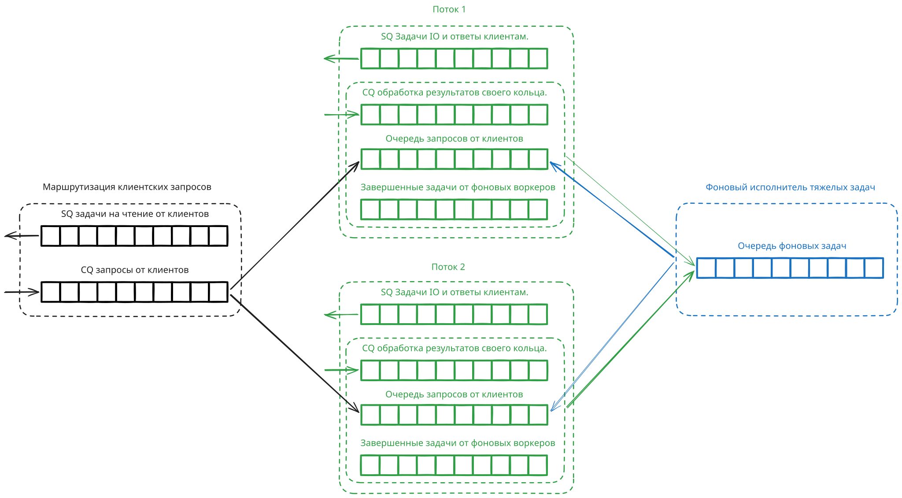

# Архитектура шарда.

Т.е. архитектура хостов связанных консенсусом. В противоположность архитектуре системы, которая представляет
собой федерацию шардов причем именно федерацию － взаимодействие между ними стремится к минимальному, ограничиваясь
практически только оффлайн-перебалансировкой и хотящим быть равномерным распределением нагрузки.

## Шард.

Шард представляет собою $n = 2f + 1$ хостов связанных [консенсусом](./consensus.md).

## Хост.

Работа на каждом хосте выглядит примерно так

В рамках работы хоста есть следующие субъекты:

1. Очереди `io_uring` принимающие запросы от клиентов, выясняющие к какому потоку они могут относиться.
   Если запрос относится к работе с конкретной сессией, он определяет с какой конкретно и отдает потоку
   работающему с этой сессией. Именно это выражается в виде разделяющегося потока в разные треды.
   Если это "создать сессию", то он каким-то образом (по индексу остатку от деления, по балансировке и мапе и т.п.)
   решает, какой поток будет заведовать созданием и ведением этой сессии.
2. Потоки. Это потоки ОС привязанные к конкретным ядрам. Каждый из них владеет своим собственным кольцом
   `io_uring`. Их задача:
  - Чтение данных от клиентов полученных от очередей или от фоновых воркеров.
  - Постановка задач в собственные SQ. Это запись в лог-файлы, отправка ответов клиентам и прочее.
  - Вычитка собственного СQ и принятие решений.
3. Фоновые исполнители тяжелых задач. Они подписаны на свою очередь, в которую им ставят задачи треды. Подписывая,
   от кого эта задача. По завершению, такие потоки пробрасывают результаты в ту же самую очередь, в которую прилетают
   запросы от клиентов.

## Задачи и объекты потоков.

Поток, так же называемый "индексом", выполняет следующие задачи:

1. Ведение логики сессий, включая учет пульса по сессиям.
2. Ответы клиентам на их запросы (через свой SQ).
3. Запись операций в лог (через свой SQ).
4. Постановка "тяжелых" задача фоновым воркерам.
5. Постановка задач зеркальным индексам на других хостах для репликации, с которым он связан собственными подключениями.

