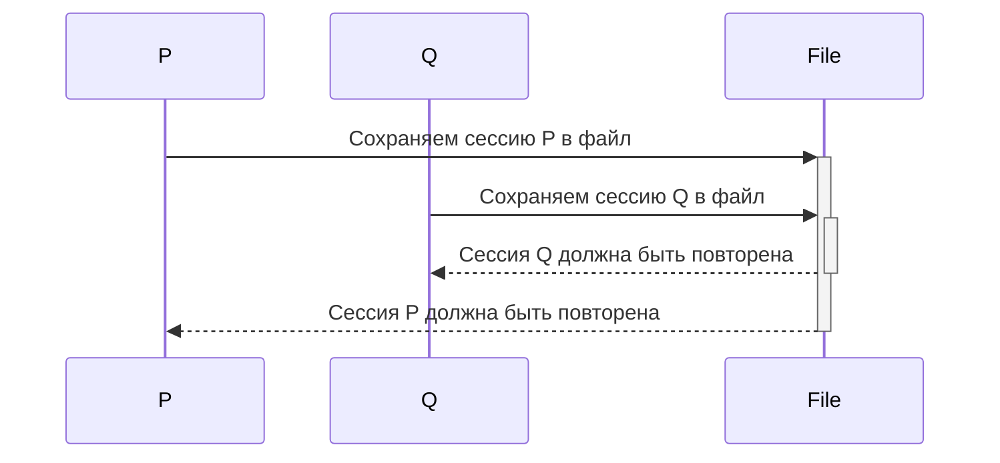
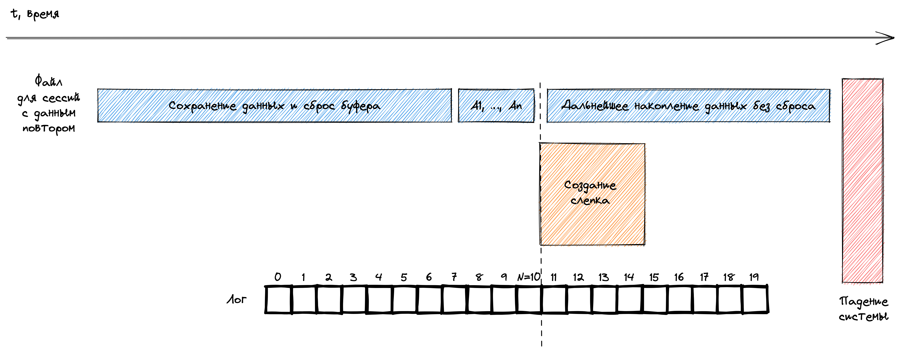
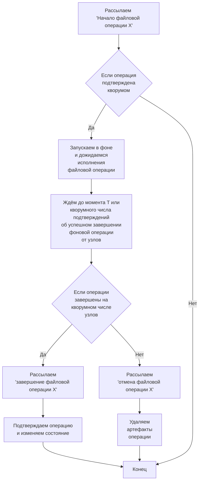
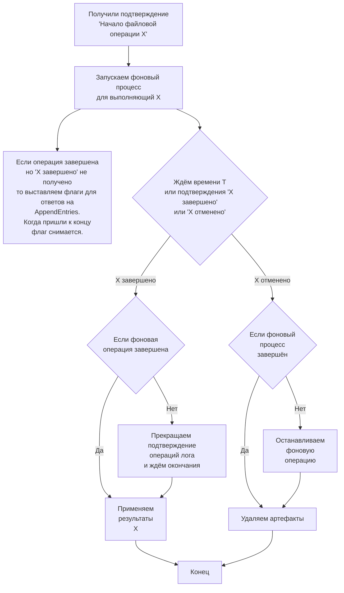
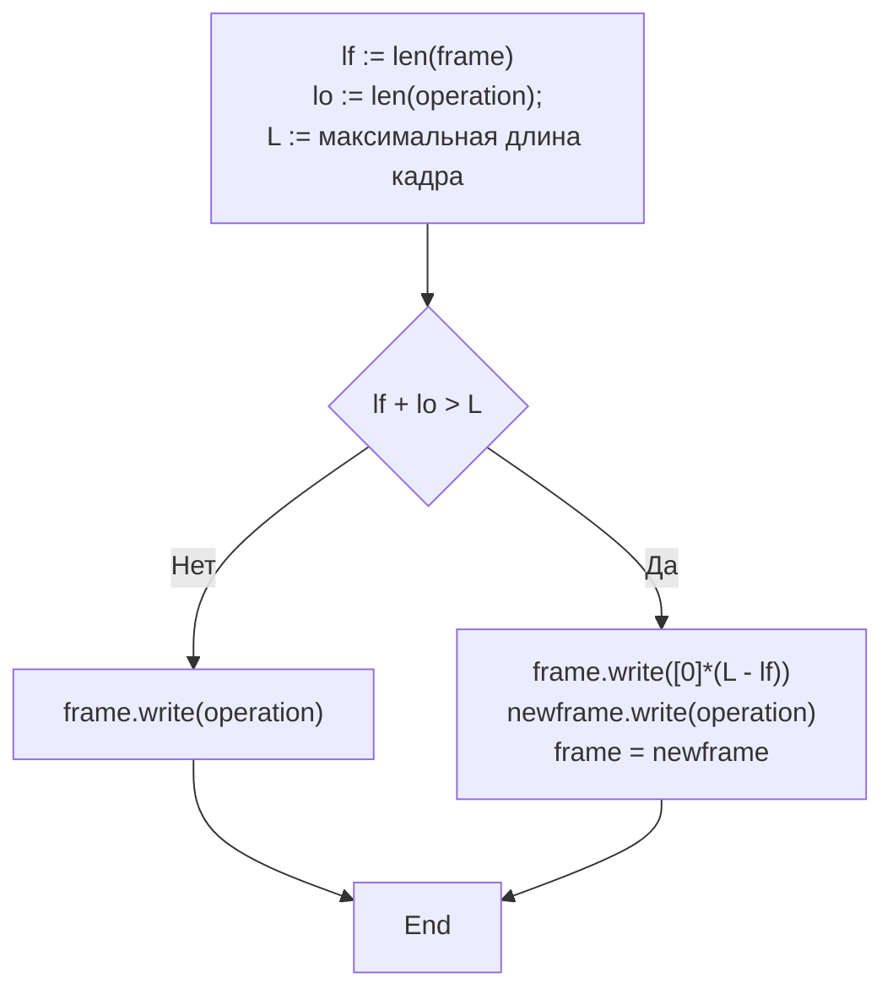

# Хранение данных

Работа RAFT строится как работа над [логом операций](log_operations.md). Репликация производится как развоз очередного 
элемента лога на машины-последователи, лог используется для восстановления состояния после запуска сервиса и т.д.

Из практики работы с одной библиотекой реализующей WAL известно, что задача восстановления данных из лога может 
быть весьма дорогой с точки зрения требуемого объёма оперативной памяти, особенно в случае большого числа долго живущих
сессий. Т.е. лог очень желательно сокращать в процессе функционирования при этом предоставляя достаточно дешёвый способ
восстановления состояния.

В материале ниже описывается предлагаемый подход реализующий эти пожелания.

## Описание восстановления данных.

Допустим, у нас есть слепок состояния A на момент времени t и лог операций, хранящий описания изменений произошедших
после t.

Чтобы восстановить состояния на момент падения нужно:

1. Построить внутреннее состояние соответствующее слепку.
2. Пробежать последовательно по операциям лога применяя каждую из них к состоянию.

Таким образом, состояние придёт к тому, что было когда была применена последняя операция из лога.

С логом всё примерно понятно, нужно понять какого рода данные у нас есть и каким образом из них нужно делать слепки.

## Описание системы хранения.

С данными на каждый конкретный момент времени t всё просто, "глобальное" состояние хранит:

* Сохранённые сессии, для которых нужно будет сделать повтор.
* Активные сессии.

Покажем, что сохранять слепок нужно для полного набора данных. Для это покажем трудно разрешимую ситуацию,
когда были сохранены только некоторые из данных:

* Обратим внимание, что операции изменения из лога могут располагаться в хаотичном порядке, когда в логе лежат 
  операции изменения совершенно разных сессий. 
* Мы сохранили состояние сессии A, но не сохранили состояние сессии B, а затем сдвинули лог исключая все записи 
  относящиеся к сессии A, то мы можем не восстановить B корректно, т.к. операции мутирующие A могут перемежаться в 
  логе с операциями для B.

Таким образом, текущее состояние при создании слепка необходимо сбрасывать **полностью**, т.к. в этом случае можно
почистить лог полностью решив задачу сформулированную в шапке. А иначе, при частичном сохранении, начало лога останется
на прежнем месте и лучшая оптимизация, что мы можем получить, это пропуск операций относящихся к сброшенным сессиям, 
что на фоне общего объёма работы может быть весьма малой величиной.

Далее рассмотрим

### Хранение сохранённых сессий

Про сохранённые сессии известно, что они затем будут возвращены, когда придёт их время, на повтор. В соответствии с
гарантиями, порядок повторов сессий детерминирован и соответствует порядку их времён начала повтора. Оптимально, таким
образом, упорядочивать записи таких сессий соответственно временам повтора. За счёт этого сам повтор станет очень 
простым:

1. Вычитали первую запись
2. Дождались времени повтора
3. Выполнили повтор
4. Повторяем начиная с шага 1

Естественно, реальный алгоритм чуть хитрее, но в любом случае сложность повтора будет равна сложности выполнения IO 
операций — которые будут производиться в любом случае, т.к. сами данные берутся оттуда.

Однозначно в общем случае не получится записывать все сохранённые сессии в один файл, на примере следующей ситуации: 

1. Сессия P сохраняется с временем повтора P(t)
2. На каком-то шаге делается слепок содержащий сессию P.
3. Затем, по прошествии какого-то времени, сессия Q сохраняется с временем Q(t), причём Q(t) < P(t).

На схеме это будет:

Т.е. в данном случае сессия Q сохранится в файле **после** сессии P, при том что её повтор должен случиться раньше.

В этом случае мы можем применить подход т.н. LSM-деревьев:

1. Вначале данные сохраняются в оперативной памяти, отсортированные по времени повторения
2. Когда их накапливается слишком много, сбрасываем их всех в файл, с сохранением порядка данных.

Таким образом мы будем иметь набор файлов где в каждом из них данные располагаются в нужном порядке.

Но, обратим внимание: коллизия была продемонстрирована для сессий с разным временем повтора и её бы не было если
время повтора для обоих сессий было бы одинаковым. 

Полагаться на то, что время повтора всех сессий одинаково нельзя. Но можно предположить, что будет иметься большое
число сессий с одинаковым фиксированным ожиданием повтора. И такие сессии вполне можно сбрасывать в один файл
(с периодическими ротациями, разумеется). Время повторов сохранённых в такие файлы сессий будет упорядочено натуральным
образом.

### Хранение активных сессий

Здесь всё довольно просто, т.к. активные сессии нужны только для восстановления в память и достаточно просто закинуть
сессии в файл в произвольном порядке.

### Смежное хранение сессий в слепках.

Как уже было замечено выше, слепки необходимо делать для всего текущего состояния. Если хранить сохранённые и активные
сессии раздельно, то мы получим две операции создания файла, которые совсем не лёгкие и неплохо было бы их подсократить.

Можно объединить эти данные в файлах слепков, например следующим образом:

| Длина данных сохранённых сессий | Данные сохранённых сессий | Длина данных активных сессий | Дамп активных сессий |
|---------------------------------|---------------------------|------------------------------|----------------------|

В результате, данные слепки будут играть роль одновременно и точек восстановления состояния, и источником сессий на 
повтор — для этой операции будет вычитываться только часть файла которая хранит "данные сохранённых сессий".

### Операция объединения и слепки.

Чтобы уменьшить количество файлов с повторяемыми сессиями, могут составляться новые, полученные "сортировкой слиянием",
а после получения объединённого файла старые, из которых получен новый, должны исключаться для дальнейшего 
использования.

Совершенно точно нельзя удалять активный (последний) слепок, поэтому операция слияния не должна его затрагивать. Старые
слепки, соответственно, могут использоваться без ограничений — они больше не нужны.

Файлы, в которых сохраняются сессии с одинаковым ожиданием повтора, так же можно рассматривать как слепки. 

### Управление файлами

Система должна знать, в каких файлах лежат данные сохранённых сессий, в какой файл пишется лог и какова его текущая 
длина.

Эта информация постоянно хранится в оперативной памяти и должна сохраняться в слепках ровно по той же причине, почему
необходимо сбрасывать оба типа сессий одновременно – хотя бы потому, что часть операций модифицирует состояние 
связанное с файлами, например команда "извлечь сессию длинной N байт из файла с сохранёнными сессиями". 

Фиксируем:

| Длина данных сохранённых сессий | Данные сохранённых сессий | Длина данных активных сессий | Дамп активных сессий | Длина дампа контроля файлов | Данные контроля файлов |
|---------------------------------|---------------------------|------------------------------|----------------------|-----------------------------|------------------------|

Большая часть операций с логом производится неявно, но есть и явное управление: переключение на другой файл лога.

### Замечание по поводу источников сохранённых сессий.

Их у нас четыре:

* Слепки
* Сохранённые сессии ещё не слитые в слепок, т.е. находящиеся в оперативной памяти.
* Слитые источники сохранённых сессий, в т.ч. слепками можно считать и файлы для хранения сессий с 
  одинаковым ожиданием повтора, т.к. у них тождественная структура.

Т.е. команда "восстановить сессию из источника" должна содержать так же информацию из какого рода источника это нужно
сделать, т.к. правила итерации и переход на следующий элемент для них различны:

* В слепках и слитых источниках анализируется содержимое файлов и данные сессии вычленяются по результатам 
  анализа, а в результате подтверждения вычитки происходит сдвиг в файле на длину куска описывающего сессию.
* В сохранённых сессиях из оперативной памяти говорится "взять сохранённую сессию из памяти", подразумевая что
  будет выбрана первая сессия оттуда, а подтверждение вычитки приводит к удалению этой первой сессии из контейнера.

### Буферизация файлов для сессий с одинаковым таймаутом повтора.

Как обычно, для оптимизации работы мы не пишем данные в файл напрямую, а прибегаем к буферизации. Это, как обычно,
может приводить к проблемам, рассмотрим их:

Поясняем, что здесь происходит:

* У нас есть файл F с сохранёнными сессиями с данной задержкой повтора.
* Есть лог.

Последовательность действий:

1. Буфер файла F сбрасывается на диск.
2. После этого в него делаются какие-то дополнительные записи A1, A2, …, An, которые оседают в буфере, 
   без сброса на диск и их повтор не успевает начаться до предстоящего падения системы.
3. После этого происходит создание слепка соответствующего некоторой позиции N в логе.
4. После этого происходит падение системы.

Во что это выливается:

* Сохранённых сессий A1, A2, …, An в слепке нет, т.к. они отправились сразу в "файл", минуя хранение в памяти.
* На диске их тоже нет, т.к. они были буферизованы, но не записаны.
* В части лога после позиции N, которая будет использована для восстановления состояния, их тоже нет, т.к. эти
  сохранённые сессии были сформированы до момента N (включительно).

Т.е. буферизованные, но не сброшенные на диск сессии с фиксированной задержкой повтора теряются безвозвратно.

Возникает вопрос, как это можно поправить?

Ответ довольно очевиден: при создании слепка момента N нужно удостовериться, что сброс буфера файла произошёл
после момента N, в таком случае вышеупомянутые A1, …, An будут сохранены на диске и не потеряются при восстановлении.

Этого можно добиться, например, принудительно сбросив буфера перед добавлением созданного слепка в лог
названий слепков.

### Выбор слепка при старте сервиса.

При старте узла сервис должен понять, в каком файле лежит последний слепок. Есть два варианта:

1. MMap-ить название последнего слепка.
2. Вести лог с названиями слепков.

Первый вариант сложнее в реализации чем второй и протирает дырку в SSD — хотя для прода использовать SSD будет
неправильно НМВ, но при разработке наверняка будет он, поэтому заботимся о разработчиках и используем лог.

Названия файлов будут храниться в текстовом логе, построчно — такой способ здесь получается наиболее экономичным так 
как оверхед получается всего 1 байт на одну строку, с бинарным представлением будет не меньше.

При старте будет вычитываться последняя непустая строка.

При подходе с логами, как обычно, возникает проблема их избыточного протухания решаемая с помощью ротации. 

Но переключаться единовременно с записью не очень хорошо, т.к. это приводит к трём системным вызовам:

1. Создание нового временного файла
2. Запись в этот файл данных
3. Переименование созданного файла в нужное имя.

Хотелось бы избежать такого большого числа сисколов в рамках выполнения одной операции, поэтому лучше применить
следующий подход:

1. Пишем имя нового слепка в лог.

После этого в фоне запускается операция:

1. Если лог пока ещё достаточно мал, то выходим.
2. Иначе создаём новый временный файл.
3. Пишем имя текущего слепка в него.
4. Переименовываем временный файл в имя лога.

## Процедура создания слепка

Она не выполняется мгновенно по очевидным причинам и за время создания может происходить масса событий 
полагающихся на систему, поэтому нужен подход который бы минимизировал время её недоступности на момент выполнения
этой операции. Т.е. некая асинхронность исполнения, когда мы вначале подготавливаем слепок в фоне, а затем просто
регистрируем его.

Будет работать, например, следующий подход:

* В структуру ответа на AppendEntries RAFT-а включается поле "слепок на состояние t подготовлен" — он заполняется когда
  слепок на узле создан.

1. С помощью лога декларируется операция "подготовка слепка состояния для данного индекса состояния".
2. Делается полный клон состояния — клонируются контейнер сохранённых сессий, список активных сессий. После чего
   начинается создание слепка (в фоне).
3. Создаётся новое текущее состояние с пустым контейнером сохранённых сессий но со списком активных сессий являющихся 
   копией текущего.
4. Старое текущее состояние не удаляется, а становится дублирующим. С этого момента все операции применяются как к
   текущему состоянию, так и к дублирующему.

После выполнения пункта 1 лидер запускает отслеживание ответов на AppendEntries, подсчитывая количество узлов 
выполнивших подготовку слепка.

После завершения подготовки слепка на лидере некий фоновый процесс на нём переходит в состояние ожидания завершения
этой операции на кворумном числе последователей, причём эта операция (ожидание) занимает конечное время:

* Если за конечное время не получилось создать кворумное число слепков, то по логу рассылается операция 
  "сбросить слепок". Её применение к состоянию означает:
  * Удаление слепка.
  * Удаление текущего состояния, удаление клонированного состояния, текущим состоянием становится дублированное.
* Если получено подтверждение создания, по логу рассылается операция "применить слепок", которая:
  * Регистрирует слепок.
  * Удаляет клонированное состояние, удаляет дублирующее состояние.

## Процедура слияния.

Как уже было сказано выше, процедура слияния — это объединение двух и более упорядоченных определённым образом 
источников сохранённых для повтора сессий в один упорядоченный источник. 

В нашем случае это объединение файлов-источников в один файл называемый "слиянием".

Такая процедура решает проблему накопления большого мелких файлов, которые при этом должны все находится в открытом
состоянии, что не очень хорошо с точки зрения ОС.

Распишем её применительно к нашим реалиям:

* У нас есть список слепков пока ещё являющихся источниками — сохранённые сессии пока не вычитаны до конца. При этом 
  разделим такие файлы на две группы:
  * Последний слепок S
  * Все слепки не являющиеся последними: S1, …, Sn.
* Есть слияния M1, …, Mk.
* Есть файлы хранящие сохранённые сессии с одинаковой задержкой повтора F1, …, Fm.
* Текущие несохранённые сессии находящиеся в данный момент в оперативной памяти.

Далее будем рассматривать только не последние слепки S1, …, Sn и существующие слияния 
M1, …, Mk. Даже не их самих, а их
содержимое начиная с первой сессией оттуда ещё не отправившейся на повтор.

Вводим градации удовлетворённости количеством источников:

* Небольшое число источников, не больше N.
* Удовлетворительное количество источников, не больше 2N.
* Слишком большое количество источников не больше 3N.
* Совсем слишком большое количество источников не больше 4N.
* Непозволительно большое количество источников не больше 5N.
* Недопустимо большое количество источников не больше 6N.
* …
* Так жить нельзя! У нас количество источников приближается к MN!
* …

Т.е. градация опирается на последововательность N, 2N, 3N, 4N, …

Процедура слияния запускается регулярно через фиксированное время после завершения предыдущей процедуры слияния и 
выполняет следующие действия:

1) Немедленное завершение работы, если количество источников ⩽N.
2) Иначе находятся те источники, время до следующей сессии из которых превосходит некоторое фиксированное Δt.
3) Из них выбирается такое количество, объединения которых достаточно для приведения в "предшествующую предшествующей" 
   градацию "удовлетворённости количеством источников", т.е. из MN → (M-2)N — в зависимости от количества источников 
   это может и не выполняться,  источников удовлетворяющих наложенному условию может быть меньше чем нужно, 
   в таком случае обрабатываем все выделенные источники. 
   В случае если текущее количество источников классифицируется как 2N, то добиваемся, по возможности, 
   слияния в один файл.
4) Начинаем процедуру объединения в новом файле.
   * Если в процессе выполнения этой процедуры началось восстановление сессии полученной из одного из этих источников, 
     то завершаем слияние удаляя генерируемый файл.
   * После завершения склейки нового файла добавляем его под контроль состояния и удаляем оттуда все файлы послужившие 
     источниками для данного слияния. 

Δt при этом выбирается достаточно большим, чтобы успеть слить данные. Скажем, минута, две минуты, три минуты и 
т.д.

## Синхронизация файловых операций.

Как уже было показано в операции создания слепка, файловая структура предполагается синхронизированной.

Почему? Потому что доведение нулевого или очень сильно отставшего узла без синхронизированной файловой структуры
получается очень дорогим и предполагает передачу полного набора данных для каждой новой попытки, что может вылиться в
следующую неприятность:

1. Нулевой узел запрашивает данные у лидера.
2. Лидер начинает возвращать сохранённые сессии из файлов.
3. В процессе передачи происходит её прекращение (лидер перестал быть лидером, лидер отвалился и т.п.)
4. Происходит второй запрос — и это может быть другой узел ставший лидером — его файловая структура может очень
   сильно отличаться: разные слепки, разные слияния, разные (хотя и очень сильно похожие) файлы для сессий с одинаковой
   задержкой повтора.
5. Новый лидер начинает возвращать сохранённые сессии из файлов. В полном объёме.
6. Бумс, опять упали.
7. И т.д.

Страшилки из пункта 4 означают, что подключающийся узел не может определить какие конкретно данные из файлов
нужно передавать. Скажем, на бывшем лидере определённый набор сохранённых сессий размещался в файле A, а на новом лидере
эти сессии могут быть в слиянии c другими источниками и сказать что-то конкретное про их размещение не представляется
возможным. Поэтому требуется полная передача данных на каждом этапе, что медленно и в итоге приводит к тому, что легко
возможна ситуация, когда подключающийся узел никогда не придёт в адекватное состояние.

Т.е. нужна инкрементальная операция, которая бы могла опираться на уже полученные данные после предыдущей попытки. 
Такое осуществимо при наличии синхронизированной структуры файлов на узлах и подход с ней описывается в следующем 
[документе](upsync.md).

А в оставшемся материале данного пункта мы изложим подход к соблюдению синхронизированности, он аналогичен подходу
описанному в [создании слепка](storage.md#процедура-создания-слепка):

1. Лидер рассылает намерение о проведении очередной файловой операции.
2. При получении кворумного подтверждения он подтверждает её и в фоне производит её исполнение 
   (без внесения в состояние).
3. Одним из следующих хартбитов или регулярных AppendEntries ведомые получают подтверждение и так же начинают
   исполнение:
   * Если до завершения исполнения подтверждена операция "X завершена", то чтение из лога приостанавливается до
     завершения операции X на данном узле.
   * Если до завершения исполнения получена операция "X отменена", то фоновый процесс останавливается, артефакты
     удаляются.
   * Когда операция завершена и получена одна из операций "X завершена" или "X отменена", то выполняется соотв.
     решение. С артефактами НИЧЕГО не делается вплоть до получения одной из этих операций.
4. Когда лидер завершает исполнение фоновой операции он ожидает вплоть до момента T её подтверждения от каждого из 
   ведомых — оно присылается в атрибутах ответа на AppendEntries (наполненных данными или просто хартбитов, неважно).
   В случае если за конечное время нужное количество подтверждений о завершении получено не было операция отменяется
   c проводкой соотв. операции через лог.
5. Ведомые, тем временем, при завершении этой операции, заполняют ответы на полученные AppendEntries соотв. атрибутами
   её завершения. 
6. Когда количество подтверждений достигает кворумного через лог отправляется сообщение 
   "Завершение файловой операции X". Если момент времени T истёк, то отправляется сообщение "Отмена операции X".
7. При её принятии кворумом происходит её подтверждение и соотв. изменение состояния. В случае если принятия кворумом 
   нет, то артефакты помечаются готовыми к удалению.

В случае если ведомый узел 

* становится лидером
* его состояние говорит о проводимой файловой операции

и его лог не содержит неподтверждённой "X завершена" или "X отменена"

То рассылается сообщение "X отменена", иначе решение о судьбе принимается на основе неподтверждённого решения об
операции X.

Замечания:

* В один момент времени возможно выполнение не более чем одной операции данного типа: переход на новый лог, создание
  нового слепка, произведение слияния и т.д.
* Данная процедура слегка расширяет канонический RAFT добавлением опциональных атрибутов. Но на свойства RAFT-а это 
  не влияет, т.к. мы могли бы отказаться от развоза атрибутов и просто, по истечении срока ожидания после завершения
  фоновой операции, слать сообщение "подтвердить файловую операцию". Атрибуты позволяют приблизить момент подтверждения
  исполнения операции.
* Момент T определяется эмпирически для каждой операции. Скажем, для слияния или создания слепка этот момент может
  быть довольно отдалённым по времени, для переключения на новый файл логов он может быть довольно близким и т.п.

Алгоритм в виде блок-схемы на лидере:

Алгоритм в виде блок-схемы на ведомом узле:

## Получена ошибка низкого уровня при операциях с хранящимися данными.

Такие ошибки всегда фатальны и приводят к немедленной остановке узла.

## Хранение лога.

В отличии от прочих субъектов храненения данных — слепков, слияний и логов слепков — лог может требовать получения 
записей сделанных начиная с определённого индекса состояния. Поэтому требуется способ каким-либо способом
ускорить поиск нужных записей в нём.

Предлагается подход деления логов на **кадры** фиксированного размера. Размер кадра записывается в первых восьми байтах
лога:

| Размер кадра (8 байт) | Кадр 1 | Кадр 2 | … | Кадр N |
|-----------------------|--------|--------|---|--------|

Каждый кадр выглядит как

| Запись операции 1 | Запись операции 2 | … | Запись операции M | Пустое пространство X заполненное нолями |
|-------------------|-------------------|---|-------------------|------------------------------------------|

Наличие пустого пространства в рамках кадра говорит о том, что имеется следующий кадр у которого первая запись по
длине превосходит размер пустого пространства. Это есть следствие алгоритма добавления новой записи:

А каждая запись выглядит как

| Идентификатор состояния при котором была сделана запись (16 байт) | Длина записи uvarint | Бинарные данные  |
|-------------------------------------------------------------------|----------------------|------------------|

Таким образом мы можем использовать алгоритм бинарного поиска чтобы быстро найти кадр, в котором находится нужная 
запись, а затем уже в самом кадре, линейно, искать нужную запись.

## Обработка состояния для кандидата ставшего лидером.

Ситуация, когда кандидат становится лидером, означает, что процессы на старом лидере, проводимые вне лога, более не 
выполняются. В частности, это означает, что активные сессии завершены неуспехом.

Поэтому лидер применяет следующие операции к состоянию:

* Нужно сохранить сессии находящиеся в активном состоянии с какой-нибудь политикой времени повтора.
* Нужно прекратить любые (асинхронные) файловые операции, их артефакты будут удалены позднее.
 
## Наглядная схема файлов хранения данных

