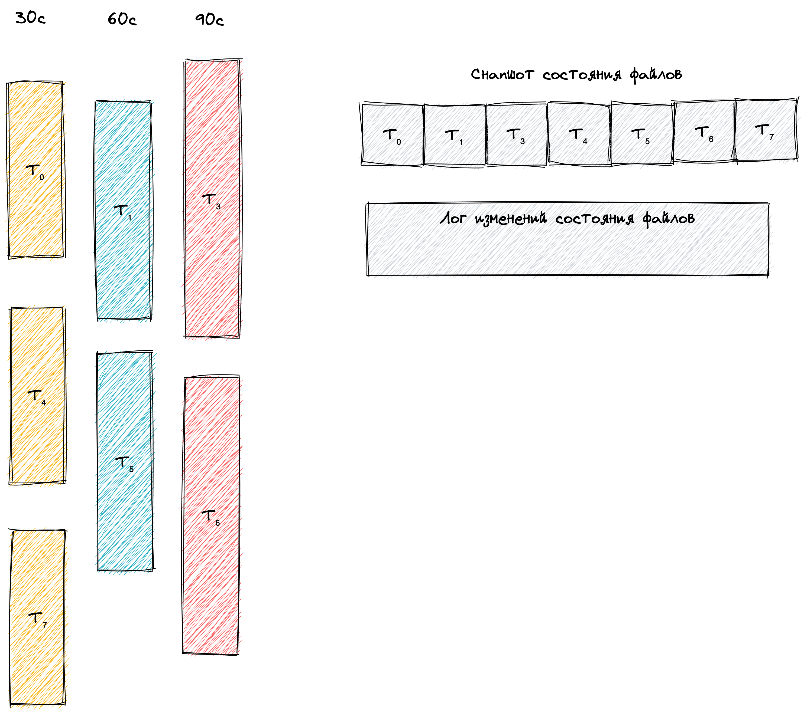

# Хранение данных

## Типы данных

Данные делятся на два типа:

* Бинарные данные незавершённых сессий (далее просто сессий).
* Данные описывающие состояние записи и чтения сессий.

## Хранение данных сессий.

Данные **неактивных** сессий с временем повтора ΔT хранятся в файлах привязанных к значению
ΔT. Т.е. сессии с одним временем повтора **могут** храниться в одном файле, сессии
же с разным временем повтора **никогда** не буду храниться в одном файле.

Записи сессий упорядочены по времени повтора, т.е. если запись сессии S₁ с временем повтора T₁ лежит перед записью
сессии S₂ с временем повтора T₂, то T₁ ⩽ T₂.

Данные сессии для записи имеют следующий формат сериализации:

| Время запланированного повтора (uint64) | Идентификатор сессии (uuid) | Топик сессии (uvarint + bytes) | Количество попыток восстановления (uvarint) | Бинарные данные (uvarint + bytes) |
|-----------------------------------------|-----------------------------|--------------------------------|---------------------------------------------|-----------------------------------|

Время от времени запись в файл с данными сессий прекращается и происходит переключение на следующий файл.

Данные **активных** сессий хранятся прямо в оперативной памяти узлов.

## Хранение данных состояний записи и чтения сессий

Данные состояний представляются в виде:

```go
[]struct{
	Name    string  // Название файла. Должно быть уникальным.
	ID      uint128 // Состояние файла привязанное к внутреннему состоянию системы. При каждом изменении файла 
	                // это значение меняется на текущее значение состояния системы.
	RWState bits    // Производится ли запись в данный момент, производится ли чтение.
	Offset  uint64  // Позиция чтения из файла.
	Len     uint64  // Длина файла.
	Replay  uint64  // Время, которое гарантированно НЕ БОЛЬШЕ чем время повтора первой сессии в данном файле.
}
```

Данные состояний 

Персистентное хранилище лога состояний распределено между **снапшотом** и **логом изменений**. Время от времени текущее 
состояние сбрасывается в снапшот и производится удаление текущего содержимого лога состояний.

### Снапшот данных состояний

Бинарные данные элементов снапшота сериализуются как

| Длина имени (uvarint) | Данные имени (bytes) | ID (uint128) | RWState (byte) | Offset (uvarint) | Len (uvarint) | Replay (uint64) |
|-----------------------|----------------------|--------------|----------------|------------------|---------------|-----------------|

Сам снапшот хранит последовательность таких элементов.

### Лог изменений данных состояний

Лог изменений содержит следующие операции:

* Создать на запись файл A (replayTimeout, currentTime)
* Прекратить запись файла A (name)
* Прекратить чтение и удалить файл A (name)
* Открыть на чтение файл A (name)
* Сдвинуть позицию чтения в файле A (name, offsetDelta)




