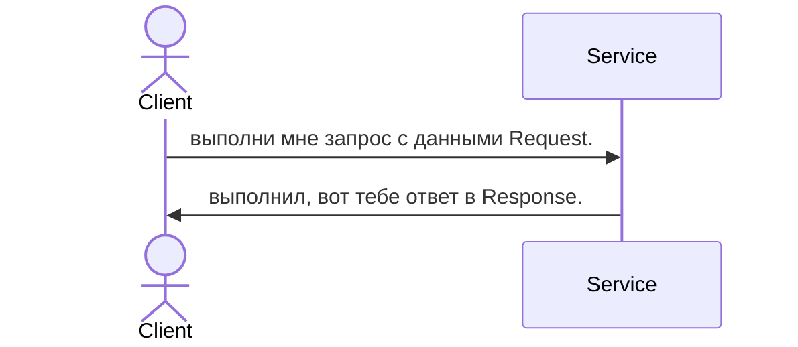
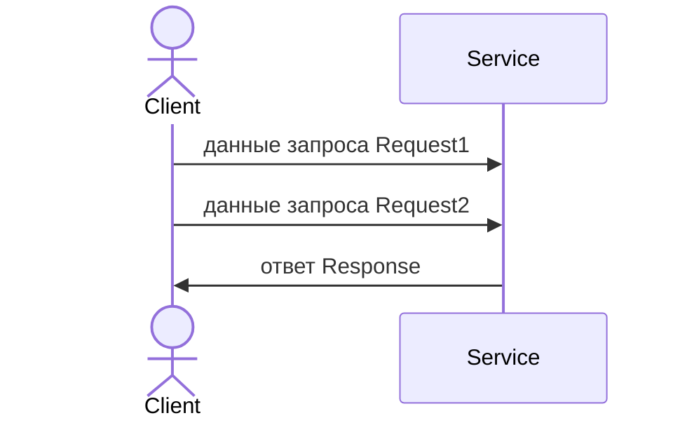
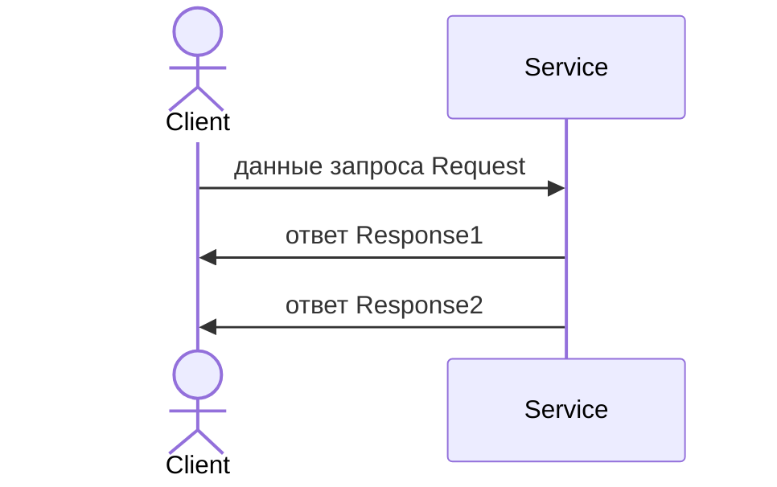
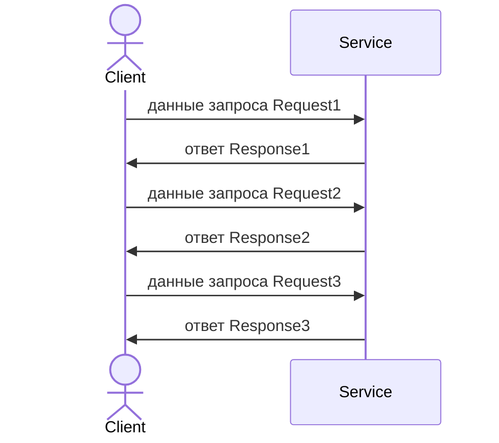
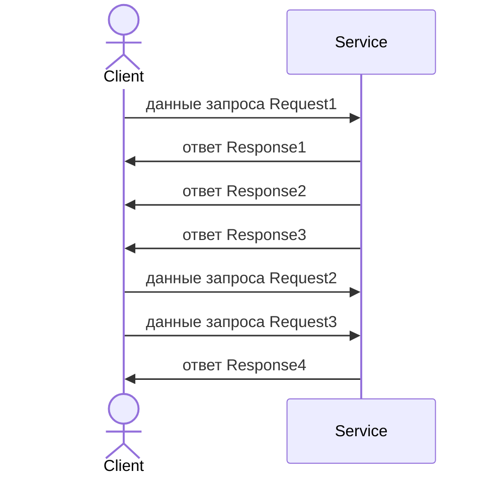

# Глоссарий.

RPC-ручки (т.е. методы сервисов) делятся на следующие категории:

## Унарный.

Он же UU от Unary-Unary, он же RR от Request-Response.

Здесь в реализации мы получаем запрос от клиента и отдаем ему ответ, после чего взаимодействие заканчивается.

## SU

От Stream-Unary.

Здесь реализация полностью вычитывает данные отдаваемые в стриме клиентом и затем отвечает одним запросом.

## US

От Unary-Stream.

Здесь реализация получает один запрос, но данные отдает постепенно.

## Бистрим.

Бистрим допускает два способа взаимодействия: **полудуплексное** и **полнодуплексное**.

### Полудуплексный бистрим.

Это, фактически, последовательность унарных запросов. Клиент шлет данные и строго ожидает ответа от сервиса на
эти данные. После чего переходит к следующему запросу. Это не обязательно так. Например, если логика "подписочная",
то клиент ожидает данные от сервиса и затем обязательно отвечает на них. Это тоже полудуплексный тип
взаимодействия.

Здесь иллюстрируется первый вариант. Второй аналогичен, просто Request и Response меняются местами.

### Полнодуплексный бистрим.

В этом типе бистримов нет вообще никакого порядка взаимодействия. Запросы ответы вообще не обязаны друг-другу
соответствовать. Например, возможно такое:

