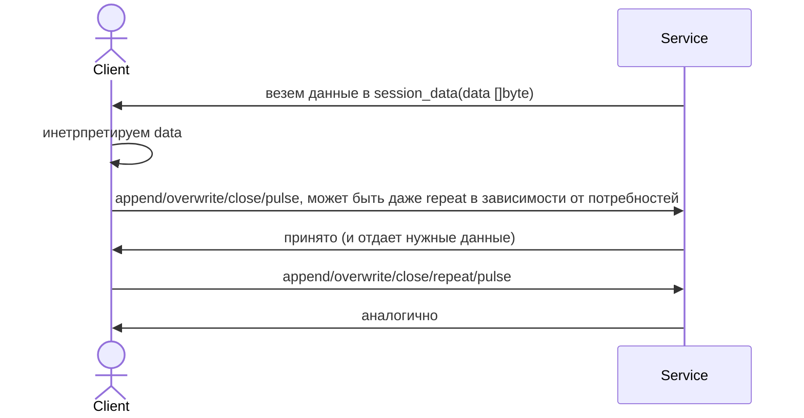

# Реализация транспорта.

В этом материале мы выберем наиболее подходящий инструментарий для транспорта, т.е. wire-протокол и инструментарий к нему.

Вначале нужно ознакомиться с [терминологией](transport_glossary.md).

## Выбор и аргументация.

Проще всего использовать существующие протоколы с готовым IDL. 

### Протоколы

Рассматривались

- [gRPC](https://grpc.io/) в реализации от Google или ByteDance/CloudWeDance ([kitex](https://www.cloudwego.io/docs/kitex/)). С [Protobuf](https://protobuf.dev/)
или [Flatbuffers](https://flatbuffers.dev/) (в kitex можно пробросить вообще любую сериализацию).
- [TTHeader](https://www.cloudwego.io/docs/kitex/reference/transport_protocol_ttheader/) от CloudWeGo с thrift по-умолчанию, но можно подсунуть все что угодно.

Выбор: TTHeader с Thrift на первых порах. Потом сериализатор может быть заменен на более эффективный, тот же Flatbuffers.

Почему: потому что схема взаимодействия - полудуплексный бистрим. Реализация полудуплексного бистрима получается
логическим образом без особых сложностей. А полнодуплексный бистрим гораздо дороже с точки зрения логики и железа.

## Реализация логического полудуплексного бистрима поверх унарных запросов TTHeader.

Итак, у нас есть список активных сессий. Каждая сессия и их хранение выглядит примерно следующим образом:

```go
package mptypes

type Session struct {
	Data       []byte // Накопленные данные сессии.
	SessionID  U128   // Идентификатор сессии. Его может и не быть здесь, см. ниже почему.
	Sequence   uint32 // Можно uint64, но нмв uint32 более чем достаточно.
}

type U128 [16]byte

// ServiceState хранит состояния сервиса.
type ServiceState struct {
	// ... какие-то внутрение поля.
	active map[U128]*Session // Набор активных сессий. Наивный вариант, в реале нужно будет держать список таких map.
	// ... еще внутренние поля, они нас здесь не интересуют.
}
```

К нам приходит входящий запрос, который делится на типы

- `create() -> sessionID`. Создать новую сессию. В ответе возвращается идентификатор созданной сессии.
- `append(meta Meta, data []byte) -> sequenceID`. Добавить данные в `Data` сессии (как `|| length: u32 | data ||`)
- `overwrite(meta Meta, data []byte) -> sequenceID`. Заменить содержимое `Data` сессии на `|| length: u32 | data ||`
- `close(meta Meta) -> void`. Удалить сессию.
- `repeat(meta Meta, d duration) -> void`. Отправить сессию на повтор через время `d`.
- `pulse(meta Meta) -> void`. "Освежить" сессию, чтобы сервис не считал ее протухшей и не отправил на повтор.

Здесь `Meta` это

```go
package mptypes

type Meta struct {
	SessionID U128
	Sequence  uint32
}
```

### Как мы обрабатываем этот запрос.

Как реализуется `create` должно быть понятно интуитивно. А вот как делается обработка остальных типов запросов. У них 
у всех имеется `meta`. Далее рассмотрим на примере `close`:

```go
package mpy6a

func (s *ServiceState) handleClose(meta *Meta) error {
	session, ok := s.active[meta.Session]
	if !ok {
		return ErrSessionNotFound
    }
	
	// Очень важно!
	if meta.Sequence != session.Sequence + 1 {
		// Присланный Sequence должен быть на единицу больше чем Sequence сессии.
		// Если он больше чем на единицу, то это означает что у нас потерялся один запрос.
		// Если меньше - клиент потерял ориентацию.
		//
		// Опционально, мы здесь так же можем разрешить приход meta.Sequence == session.Sequence.
		// Но при условии, что он равен предыдущему запросу до байта. И в этом случае возвращать
		// "все успешно", ничего при этом не делая. Рекомендую не делать пока, так как это потребует
		// дополнительных вычислений (контрольную сумму) или памяти (хранить предыдущий запрос для сверки).
		return ErrInvalidSequence
    }
	
	// Удаляем сессию.
	// Для других методов будет аналогично - бизнес-логика с данными сессии.
	delete(s.active, meta.SessionID)
	
	return nil
}
```

## Замечания по поводу протокола компенсаторов.

Он выглядит почти зеркально, отличаясь только заменой `create` на `session_data`, содержащей накопленные данные сессии.
Работает следующим образом:



## Неудобства работы с TTHeader.

Более сложная логика контроля таймаута на сессиях. Придется каким-то образом организовать регулярные пробеги
по всем активным сессиям, чтобы определить их свежесть. Сессии, которых слишком долго никто не касался
должны отправляться на повтор. Есть разные популярные алгоритмы по этому поводу, например "хеш-колеса" (Timing Wheel)
используемые в ядре Linux, Kafka и т.п.

И нет, это не дороже "естественных таймаутов" в рамках обработки gRPC-бистрима сессии в одной горутине. Там выполняется
совершенно аналогичная логика, которая весит ровно столько же. Просто, там это досталось бы нам в готовом виде,
а здесь придется писать самому.