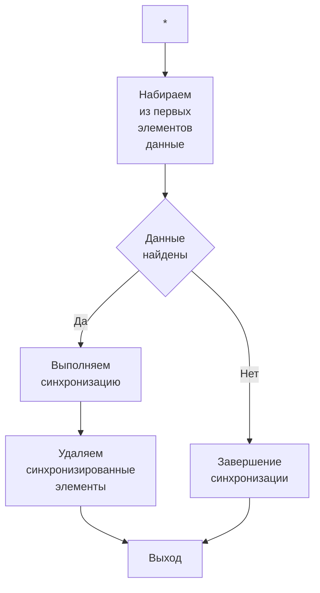

# Синхронизация подключившейся ноды

При подключении узла к кластеру возникает задача получения или актуализации данных от лидера кластера таким образом, 
чтобы в какой-то не слишком удалённый квант времени узел пришёл в состояние лидера.

Теоретически это вполне осуществимо ввиду того, что события изменяющие внутренние состояния кластера представляют 
собой последовательность: пока одно событие не обработано, следующее событие ожидает очереди на своё исполнение. 
Для того чтобы привести новый узел в актуальное состояние за конечное время достаточно высылать два или более логических 
события не реже чем через одно событие в рамках работы системы.

## Синхронизируемые данные.

Нужно передать следующие данные:

* Данные об неактивных сессиях.
* Данные об состоянии файлов.
* Активные сессии.

Так же в процессе довоза данных может происходить следующее:

* Появление новых активных сессий.
* Модификация активных сессий.
* Удаление активных сессий.
* Сброс сессий в файл, т.е. модификация файлов и описаний их состояния.
* Появление новых файлов и соотв. описания их состояний.
* Удаление файлов и описаний их состояния.

Ещё условимся, что файл передаётся следующим образом

| Данные сессии 1 | Данные сессии 2 | …   | Данные сессии N | Описание состояния файла |
|-----------------|-----------------|-----|-----------------|--------------------------|

## Упорядочивание синхронизируемых данных.

Каждая синхронизируемая сущность, так же как и каждая отдельная операция имеют аттрибут ID, который в т.ч. и 
характеризует порядок, в котором производилась работа с этими сущностями.

Для процедуры синхронизации поэтому мы работаем с контейнером, который представляет собой последовательность 
упорядоченную по идентификаторам состояний сущностей которые должны быть синхронизированы. 

* Данные файла + состояние работы с файлом
* Активные сессии
* Извещения об удалении активной сессии
* Извещения об удалении файла

Сюда не входят события об изменении сессии, почему станет понятно прямо сейчас:

При работе с сущностью изменяется её идентификатор состояния, поэтому сущность неизбежно уплывает в конец контейнера.

## Процедура синхронизации.

Синхронизация данных выполняется пошагово и один шаг синхронизации выглядит следующим образом:

Между двумя шагами синхронизации при этом может происходить изменение контейнера с синхронизируемыми данными.
Изменения могут быть следующего толка:

### Изменения файлов

Изменения могут быть следующего толка и они указанным образом сказываются на контейнере:

* Была добавлена запись в файл или было произведено чтение из него, то:
  1. Если в контейнере есть упоминание этого файла, то удаляем его.
  2. Помещаем операцию синхронизации файла в конец контейнера.
* Было произведено удаление файла
  1. Если в контейнера есть упоминание этого файла, то удаляем его.
  2. Помещаем операцию удаляения файла в конец контейнера. 
* Файл был создан
  1. Помещаем операцию создания файла в конец контейнера.

### Работа с активными сессиями

* Создание активной сессии. Здесь два варианта:
  * Создание активной сессии с нуля.
    1. Добавление операции синхронизации активной сессии в конец контейнера.
  * Создание активной сессии во время операции повтора. Это просто последовательность двух операций.

    | Чтение из файла | Создание активной сессии с нуля |
    |-----------------|---------------------------------|

* Было изменение активной сессии.
  1. Если в контейнере есть упоминание этой сессии, то удаляем её.
  2. Помещаем в конец контейнера операцию синхронизации данной сессии.
* Активная сессия была удалена
  1. Если в контейнере есть упоминание этой сессии, то удаляем её.
  2. Помещаем в конец контейнера операцию удаления сессии.
* Активная сессия превращена в неактивную и сброшена на диск.
  Это последовательность операций
  
  | Добавление записи в файл | Удаление активной сессии |
  |--------------------------|--------------------------|

## Описания процедур синхронизации разных сущностей.

### Синхронизация файлов.

Как уже было упомянуто, синхронизация файла означает синхронизацию содержимого файла и затем синхронизацию данных
контроля состояния файла.

Процедура, таким образом, выражается в виде последовательности

| Перевоз сессии 1 | Перевоз сессии 2 | …   | Перевоз сессии N | Перевоз данных состояния |
|------------------|------------------|-----|------------------|--------------------------|

Где, разумеется, передаётся по два или более компонентов из данной последовательности за раз.

При проведении синхронизации на лидере можно обладать всей текущей информацией о состоянии синхронизирующегося узла,
в т.ч. можно можно знать какие данные УЖЕ есть на узле. В этом случае перевозить можно только те данные, которых
там ещё нет. Таким образом может быть сильно ускорена работа для недавно отвалившихся и вскоре быстро 
переподключившихся узлов, т.е. данные могут передавать не начиная с сессии 1, а с некоторой сессии K в недрах
файла.

### Синхронизация активных сессий.

Синхронизируется вся сессия целиком.

